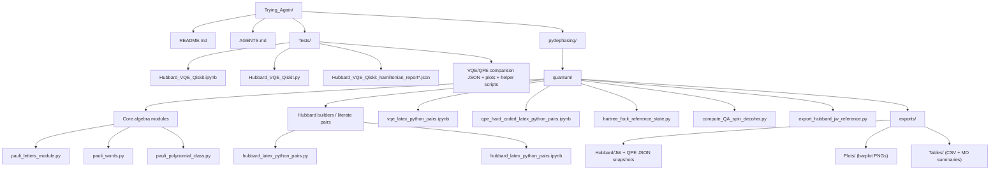

# Repository Mermaid Diagram

```mermaid
flowchart TD
    ROOT["Trying_Again/"]

    ROOT --> README["README.md"]
    ROOT --> AGENTS["AGENTS.md"]
    ROOT --> TESTS["Tests/"]
    ROOT --> PYD["pydephasing/"]

    TESTS --> T_QISKIT_NB["Hubbard_VQE_Qiskit.ipynb"]
    TESTS --> T_QISKIT_PY["Hubbard_VQE_Qiskit.py"]
    TESTS --> T_QISKIT_JSON["Hubbard_VQE_Qiskit_hamiltonian_report*.json"]
    TESTS --> T_VQE["VQE/QPE comparison JSON + plots + helper scripts"]

    PYD --> Q["quantum/"]

    Q --> Q_CORE["Core algebra modules"]
    Q_CORE --> Q_LETTERS["pauli_letters_module.py"]
    Q_CORE --> Q_WORDS["pauli_words.py"]
    Q_CORE --> Q_POLY["pauli_polynomial_class.py"]

    Q --> Q_HUBBARD["Hubbard builders / literate pairs"]
    Q_HUBBARD --> Q_HUBBARD_PY["hubbard_latex_python_pairs.py"]
    Q_HUBBARD --> Q_HUBBARD_NB["hubbard_latex_python_pairs.ipynb"]

    Q --> Q_VQE_NB["vqe_latex_python_pairs.ipynb"]
    Q --> Q_QPE_NB["qpe_hard_coded_latex_python_pairs.ipynb"]
    Q --> Q_HF["hartree_fock_reference_state.py"]
    Q --> Q_UTIL["compute_QA_spin_decoher.py"]
    Q --> Q_EXPORTER["export_hubbard_jw_reference.py"]

    Q --> EXPORTS["exports/"]
    EXPORTS --> EX_JSON["Hubbard/JW + QPE JSON snapshots"]
    EXPORTS --> EX_PLOTS["Plots/ (barplot PNGs)"]
    EXPORTS --> EX_TABLES["Tables/ (CSV + MD summaries)"]
```
